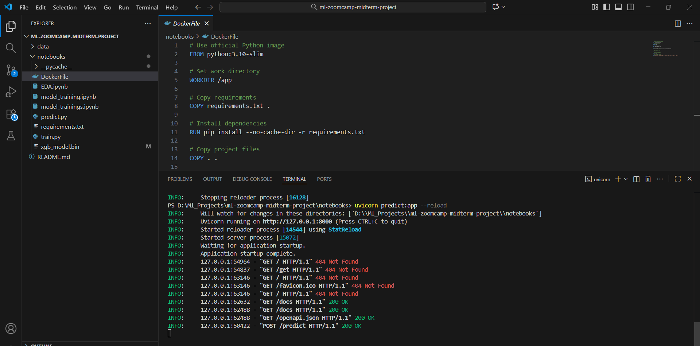
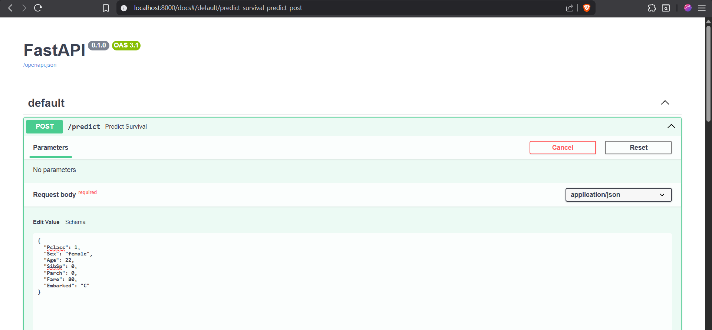
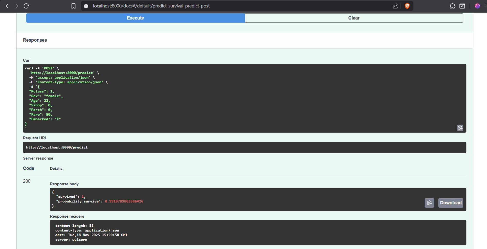
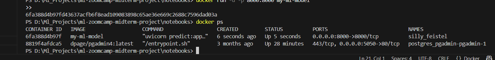
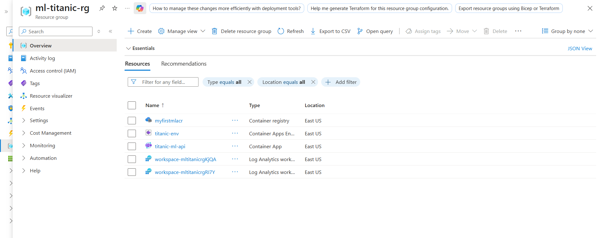
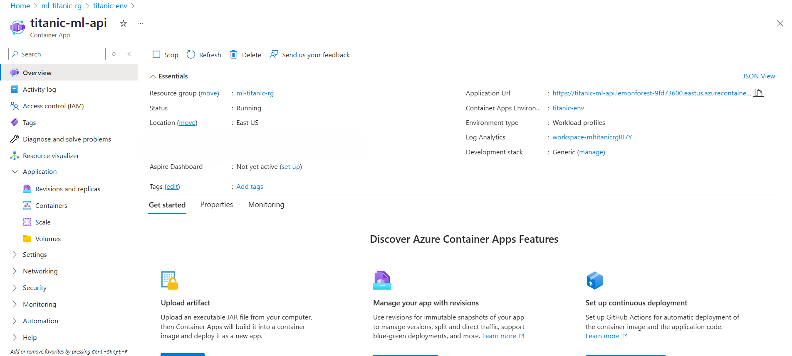
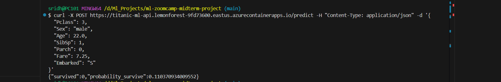
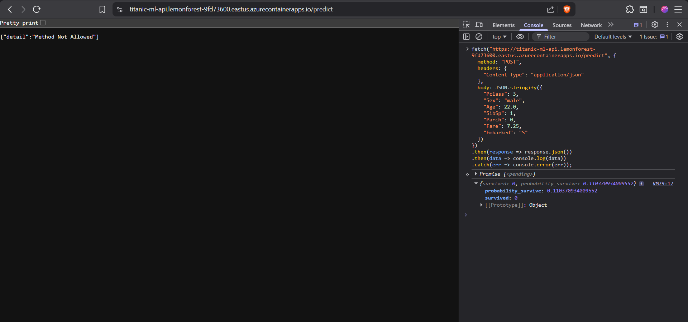

# Titanic Survival Prediction – ML Zoomcamp Midterm Project

## Project Overview
The goal of this project is to predict **survival on the Titanic** based on passenger characteristics.  
I use the **Titanic dataset** from Kaggle: [Titanic Dataset](https://www.kaggle.com/datasets/yasserh/titanic-dataset/).

**Objective:** Build multiple machine learning models, compare them, and select the best one for deployment.

---

## Dataset Description
The dataset contains 891 training samples with 12 columns:

| Column       | Description                                    |
| ------------ | ---------------------------------------------- |
| PassengerId  | Unique passenger ID                            |
| Survived     | Target variable (0 = No, 1 = Yes)              |
| Pclass       | Ticket class (1 = 1st, 2 = 2nd, 3 = 3rd)       |
| Name         | Passenger name                                 |
| Sex          | Gender                                         |
| Age          | Age in years                                   |
| SibSp        | # of siblings / spouses aboard                 |
| Parch        | # of parents / children aboard                 |
| Ticket       | Ticket number                                  |
| Fare         | Passenger fare                                 |
| Cabin        | Cabin number                                   |
| Embarked     | Port of embarkation (C = Cherbourg, Q = Queenstown, S = Southampton) |

### Missing Values
- `Age`: 177 missing → filled with median  
- `Embarked`: 2 missing → filled with mode  
- `Cabin`: 687 missing → dropped for baseline model  

---

## Exploratory Data Analysis (EDA)

### Key Observations:
1. **Sex and survival:** Females had a significantly higher survival rate.  
2. **Pclass and survival:** 1st-class passengers survived more often than 3rd-class passengers.  
3. **Age:** Younger passengers had slightly higher survival probability.  
4. **Fare:** Higher fare is associated with higher survival rate.  
5. **Family relationships (SibSp + Parch):** Travelling alone had lower survival chances.  
6. **Embarked:** Passengers from Cherbourg (C) survived slightly more.  

---

## Feature Engineering

- Selected features for baseline model:
  - `Pclass`, `Sex`, `Age`, `SibSp`, `Parch`, `Fare`, `Embarked`  
- Dropped unnecessary columns: `PassengerId`, `Name`, `Ticket`, `Cabin`  
- Categorical features encoded with `DictVectorizer`

---

## Model Training

I trained **multiple models** to compare performance:

1. **Logistic Regression**  
2. **Decision Tree** (tested max_depth = 3, 5, 7, 10, None)  
3. **Random Forest** (n_estimators = 200, max_depth = 8)  
4. **Gradient Boosting (Scikit-learn / XGBoost)**

### Training & Validation Split
- Train + validation: 80% of data  
- Test set: 20% (held-out for final evaluation)

### Evaluation Metric
- Accuracy on validation set
  
### Validation Accuracy of Models:

| Model                  | Validation Accuracy |
|------------------------|------------------ |
| Logistic Regression    | 0.787             |
| Decision Tree          | 0.826             |
| Random Forest          | 0.826             |
| Gradient Boosting      | 0.798             |
| XGBoost                | 0.843             |

- **Best Model:** XGBoost

### Retraining Best Model
- The **XGBoost model** was retrained on the full training + validation dataset.  
- Tested on the held-out test set for final evaluation.  

### Feature Analysis
- Feature names were extracted using `DictVectorizer`.  
- Feature importance was plotted for the top 15 features.

### Example Prediction
Sample passenger:

```python
person = {
    "Pclass": 1,
    "Sex": "female",
    "Age": 30,
    "SibSp": 0,
    "Parch": 0,
    "Fare": 80,
    "Embarked": "C"
}

Predicted survival using XGBoost:

{
    "probability_survive": 0.98,
    "survived": 1
}

```

## Model Training and Prediction Scripts

### train.py

This script trains the final XGBoost model and saves it along with the feature vectorizer.

**Steps performed:**
1. Load the training dataset (`train.csv`).  
2. Fill missing values:
   - `Age` → median  
   - `Embarked` → mode `"S"`  
3. Select features for the model:  
   `Pclass`, `Sex`, `Age`, `SibSp`, `Parch`, `Fare`, `Embarked`  
4. Convert categorical features to numeric using `DictVectorizer`.  
5. Train an XGBoost classifier with the chosen hyperparameters:  
   - `n_estimators=200`  
   - `max_depth=4`  
   - `learning_rate=0.1`  
6. Save the trained model and vectorizer to `xgb_model.bin`.

**Usage:**

```bash
cd notebooks
```


```bash
python train.py

```


## predict.py

This script creates a simple web API using **FastAPI** to predict Titanic survival.

**Steps performed:**

1. Load the saved model and vectorizer from `xgb_model.bin`.  

2. Define the input data structure using the `Passenger` class (Pydantic):  

   - `Pclass`: int  
   - `Sex`: str  
   - `Age`: float  
   - `SibSp`: int  
   - `Parch`: int  
   - `Fare`: float  
   - `Embarked`: str  

3. Create a POST endpoint `/predict` that:
   - Transforms input data using the vectorizer  
   - Predicts survival probability and class using the trained XGBoost model  
   - Returns a JSON response with:

```json
Example Post Payload:
POST /predict
{
  "Pclass": 1,
  "Sex": "female",
  "Age": 30,
  "SibSp": 0,
  "Parch": 0,
  "Fare": 80,
  "Embarked": "C"
}

Result:
{
  "survived": 1,
  "probability_survive": 0.98
}

```

### How to Run FastAPI With Uvicorn

```bash
pip install fastapi uvicorn

uvicorn predict:app --reload --host 0.0.0.0 --port 8000
```








## Dockerizing the FastAPI App

You can run the Titanic prediction API in a Docker container using the following steps.

### 1. `requirements.txt`

The required Python packages:
```
pandas 
numpy
scikit-learn
xgboost
fastapi
uvicorn
```

### 2. Dockerfile

Create a file named `Dockerfile` with the following content:
```
FROM python:3.10

WORKDIR /app

COPY requirements.txt .
RUN pip install -r requirements.txt

COPY . .

EXPOSE 8000

CMD ["uvicorn", "predict:app", "--host", "0.0.0.0", "--port", "8000"]
```


**Explanation:**

1. `FROM python:3.10` → Use Python 3.10 as the base image  
2. `WORKDIR /app` → Set the working directory in the container  
3. `COPY requirements.txt .` → Copy the requirements file  
4. `RUN pip install -r requirements.txt` → Install dependencies  
5. `COPY . .` → Copy all project files into the container  
6. `EXPOSE 8000` → Expose port 8000 for the API  
7. `CMD ["uvicorn", "predict:app", "--host", "0.0.0.0", "--port", "8000"]` → Start the FastAPI server
---

### 3. Build the Docker Image

To Navigate to Main Folder

```bash
.. 
```


```bash
docker build -t my-ml-model .
```

### 4. Run the Docker Container

```
docker run -p 8000:8000 my-ml-model
```



## Deploying the Titanic Prediction API to Azure

Here’s how I deployed my Dockerized FastAPI Titanic prediction app to **Azure Container Apps**.

---

### STEP 1 - Make sure you are logged in

If you haven't logged in with your tenant yet, run:

```bash
az login --tenant YOUR_TENANT_ID
```

### STEP 2 - Create the Resource Group

If you haven’t already created a resource group, run:

```bash
az group create \
  --name ml-titanic-rg \
  --location eastus
```

### STEP 3 - Create Azure Container Registry (ACR)

I pushed my Docker image to ACR before deploying.

```bash
az acr create \
  --resource-group ml-titanic-rg \
  --name myfirstmlacr \
  --sku Basic
```

### STEP 4 - Log in to ACR
```bash
az acr login --name myfirstmlacr
```

### STEP 5 - Tag your Docker image
```bash
my-ml-model:latest
```

## Now I tagged it for ACR:
docker tag my-ml-model:latest myfirstmlacr.azurecr.io/my-ml-model:latest
```

STEP 6 - Push the image to ACR
```bash
docker push myfirstmlacr.azurecr.io/my-ml-model:latest
```

### STEP 7 - Create Azure Container Apps Environment
This environment is required before creating the container app:
```bash
az containerapp env create \
  --name ml-env \
  --resource-group ml-titanic-rg \
  --location eastus
```

### STEP 8 - Deploy your Container App
Finally, I deployed my containerized API:
```bash
az containerapp create \
  --name titanic-ml-api \
  --resource-group ml-titanic-rg \
  --environment ml-env \
  --image myfirstmlacr.azurecr.io/my-ml-model:latest \
  --target-port 8000 \
  --ingress external \
  --registry-server myfirstmlacr.azurecr.io \
  --query properties.configuration.ingress.fqdn
```






